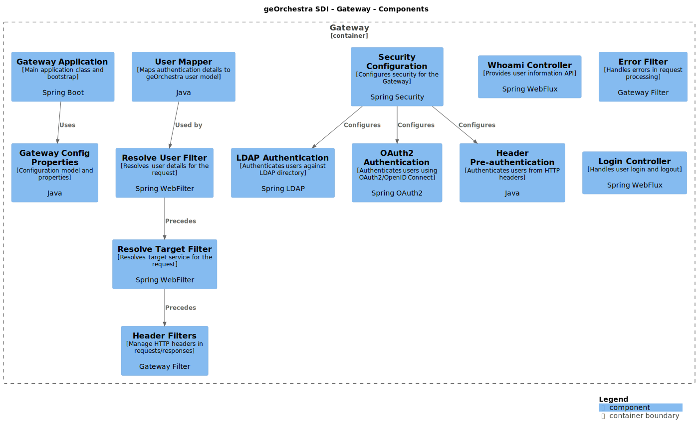

# Component View

This section describes the internal structure of the geOrchestra Gateway in terms of its key components and their interactions.

## Component Diagram

The component diagram shows the detailed internal structure of the geOrchestra Gateway, including its constituent components and their relationships.

This diagram shows the detailed internal structure of the Gateway with components organized into functional layers:

1. **Core Application Components**
     - The main Gateway Application class
     - Configuration Properties that model the Gateway's configuration

2. **Web API Layer**
     - Login/Logout Controller for authentication endpoints
     - Whoami Controller for retrieving user information
     - Error Handler for custom error pages

3. **Security Layer**
     - Security Configuration for setting up Spring Security
     - Access Rules for role-based authorization
     - Authentication Providers (LDAP, OAuth2, Header)
     - User Mapper for translating authentication results to GeorchestraUser objects
     - Role Mapping for extending user roles

4. **Filter Layer**
     - Global Filters like ResolveGeorchestraUserFilter
     - Gateway Filter Factories for creating request/response filters
     - Header Contributors for adding security headers

> Note: This diagram is generated from the Structurizr DSL definition in `/docs/structurizr/workspace.dsl`. See the [Using Structurizr](using-structurizr.md) guide for more information.
## Key Components

### Core Components

- **GeorchestraGatewayApplication**: Main entry point for the application
- **GatewaySecurityConfiguration**: Configures Spring Security for the Gateway
- **GatewayConfigProperties**: Configuration properties for the Gateway

### Authentication Components

- **LdapAuthenticationConfiguration**: LDAP authentication configuration
- **OAuth2Configuration**: OAuth2/OpenID Connect configuration
- **LoginLogoutController**: Handles login and logout requests

### Authorization Components

- **AccessRulesConfiguration**: Configures access rules
- **GeorchestraUserRolesAuthorizationManager**: Enforces role-based access control

### User Management Components

- **ResolveGeorchestraUserGlobalFilter**: Resolves the geOrchestra user from the security context
- **GeorchestraUserMapper**: Maps authentication information to geOrchestra user objects

### Header Management Components

- **HeaderFiltersConfiguration**: Configures header filters
- **AddSecHeadersGatewayFilterFactory**: Adds security headers to requests
- **RemoveSecurityHeadersGatewayFilterFactory**: Removes security headers from requests

### Filter Components

#### Global Filters
- **ResolveGeorchestraUserGlobalFilter**: Extracts authenticated user information
- **ResolveTargetGlobalFilter**: Determines the target service configuration
- **GlobalUriFilter**: Fixes URI encoding issues

#### Gateway Filter Factories
- **ApplicationErrorGatewayFilterFactory**: Handles application errors and creates friendly responses
- **LoginParamRedirectGatewayFilterFactory**: Redirects to login when requested
- **RemoveSecurityHeadersGatewayFilterFactory**: Removes incoming sec-* headers to prevent impersonation
- **AddSecHeadersGatewayFilterFactory**: Adds user and organization headers for backend services
- **CookieAffinityGatewayFilterFactory**: Modifies cookie paths for service sharing
- **StripBasePathGatewayFilterFactory**: Removes base path prefixes
- **RouteProfileGatewayFilterFactory**: Enables routes based on active Spring profiles

## Component Interactions

1. **Authentication Flow**:
     - The `LoginLogoutController` handles login requests
     - Depending on the configuration, either `LdapAuthenticationConfiguration` or `OAuth2Configuration` processes the authentication
     - Once authenticated, the `ResolveGeorchestraUserGlobalFilter` resolves the user from the security context

2. **Request Processing Flow**:
     - The Gateway receives a request
     - Authentication filters process the request (LDAP, OAuth2, or Pre-auth)
     - The `RemoveSecurityHeadersGatewayFilterFactory` removes any incoming security headers
     - The `ResolveGeorchestraUserGlobalFilter` resolves the user from the security context
     - The `ResolveTargetGlobalFilter` resolves the target service configuration
     - The `AccessRulesConfiguration` checks if the user has access to the requested resource
     - Various application-specific filters may process the request (StripBasePath, RouteProfile, etc.)
     - The `AddSecHeadersGatewayFilterFactory` adds security headers to the outgoing request
     - The request is proxied to the target service via the Proxy Filter

3. **Configuration Loading**:
     - The `GatewayConfigProperties` loads configuration from the data directory
     - The `AccessRulesConfiguration` loads access rules from the configuration
     - The `HeaderFiltersConfiguration` loads header configurations from the configuration
