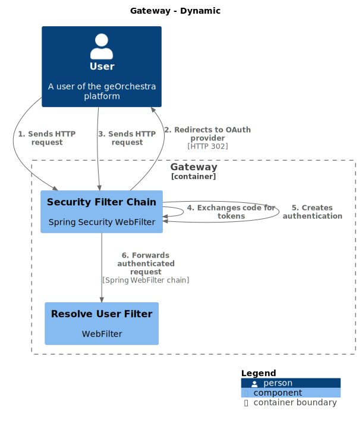

# Runtime View

The runtime view describes the dynamic aspects of the geOrchestra Gateway, showing how the various components interact during typical scenarios.

## C4 Microservices Diagram

This diagram shows the Gateway in its deployment context, interacting with other microservices and infrastructure components.

```mermaid
flowchart TD
    classDef container fill:#438DD5,stroke:#2E6295,color:#fff
    classDef service fill:#85BBF0,stroke:#5D82A8,color:#000
    classDef database fill:#438DD5,stroke:#2E6295,color:#fff,shape:cylinder
    classDef person fill:#08427B,stroke:#052E56,color:#fff
    classDef external fill:#999999,stroke:#6B6B6B,color:#fff

    User((Web User)):::person

    subgraph DockerEnvironment [Docker Environment]
        direction TB

        Gateway[Gateway<br/><font size=2>Spring Cloud Gateway</font>]:::service

        subgraph georch [geOrchestra Microservices]
            direction TB
            GeoServer[GeoServer<br/><font size=2>Map Server</font>]:::service
            GeoNetwork[GeoNetwork<br/><font size=2>Metadata Catalog</font>]:::service
            MapStore[MapStore<br/><font size=2>Web Viewer</font>]:::service
            Console[Console<br/><font size=2>User Management</font>]:::service
            Analytics[Analytics<br/><font size=2>Usage Statistics</font>]:::service
            DataFeeder[DataFeeder<br/><font size=2>Data Import Tool</font>]:::service
        end

        subgraph Infrastructure [Infrastructure Services]
            LDAP[(LDAP<br/><font size=2>User Directory</font>)]:::database
            Database[(PostgreSQL<br/><font size=2>Database</font>)]:::database
            RabbitMQ[(RabbitMQ<br/><font size=2>Message Broker</font>)]:::database
            DataDir[Datadir<br/><font size=2>Configuration Volume</font>]:::service
        end

        Gateway -- "Reads configuration<br/>from" --> DataDir
        Gateway -- "Authenticates<br/>users via" --> LDAP
        Gateway -- "Publishes events<br/>to" --> RabbitMQ

        Gateway -- "Routes to" --> GeoServer
        Gateway -- "Routes to" --> GeoNetwork
        Gateway -- "Routes to" --> MapStore
        Gateway -- "Routes to" --> Console
        Gateway -- "Routes to" --> Analytics
        Gateway -- "Routes to" --> DataFeeder

        Console -- "Manages users in" --> LDAP
        Console -- "Uses" --> Database
        Console -- "Consumes events from" --> RabbitMQ
        GeoServer -- "Connects to" --> Database
        GeoNetwork -- "Connects to" --> Database
        Analytics -- "Reads from" --> Database
    end

    User -- "Accesses via<br/>HTTPS" --> Gateway

    ExternalOAuth[(External OAuth<br/>Providers)]:::external
    Gateway -- "Authenticates via<br/>OAuth2/OIDC" --> ExternalOAuth
```

## Key Runtime Scenarios

### Authentication Flow

1. **LDAP Authentication Flow**

   ```mermaid
   sequenceDiagram
       actor User
       participant Gateway
       participant LDAP

       User->>Gateway: 1. Request protected resource
       Gateway->>User: 2. Redirect to login page
       User->>Gateway: 3. Submit credentials
       Gateway->>LDAP: 4. Validate credentials
       LDAP->>Gateway: 5. Authentication result

       alt Authentication successful
           Gateway->>LDAP: 6a. Load user attributes
           LDAP->>Gateway: 7a. User attributes
           Gateway->>Gateway: 8a. Create session
           Gateway->>User: 9a. Redirect to original request
       else Authentication failed
           Gateway->>User: 6b. Show error message
       end
   ```

2. **OAuth2/OpenID Connect Authentication Flow**

   ```mermaid
   sequenceDiagram
       actor User
       participant Gateway
       participant OAuth2Provider

       User->>Gateway: 1. Request protected resource
       Gateway->>User: 2. Redirect to login page
       User->>Gateway: 3. Click OAuth2 provider button
       Gateway->>OAuth2Provider: 4. Redirect to authorization endpoint
       OAuth2Provider->>User: 5. Show login page
       User->>OAuth2Provider: 6. Submit credentials
       OAuth2Provider->>Gateway: 7. Authorization code
       Gateway->>OAuth2Provider: 8. Exchange code for token
       OAuth2Provider->>Gateway: 9. Access token & user info
       Gateway->>Gateway: 10. Map to GeorchestraUser
       Gateway->>User: 11. Redirect to original request
   ```

3. **Request Processing Flow**

   ```mermaid
   sequenceDiagram
       actor User
       participant Gateway
       participant BackendService

       User->>Gateway: 1. HTTP request
       Gateway->>Gateway: 2. Route matching
       Gateway->>Gateway: 3. Remove security headers
       Gateway->>Gateway: 4. Resolve user
       Gateway->>Gateway: 5. Check access rules
       Gateway->>Gateway: 6. Apply path transformations
       Gateway->>Gateway: 7. Add security headers
       Gateway->>BackendService: 8. Forward request
       BackendService->>Gateway: 9. Response
       Gateway->>User: 10. Return response
   ```

## Structurizr Dynamic Views

As an alternative to Mermaid diagrams, we're also providing Structurizr DSL definitions for dynamic views. These are automatically generated from the DSL definition in `/docs/structurizr/dynamic-views.dsl`:

1. **Authentication Flow** - Shows the sequence of interactions during user authentication
   

2. **OAuth Flow** - Details the OAuth2/OpenID Connect authentication process
   

See the [Using Structurizr](using-structurizr.md) guide for more information about the Structurizr diagrams.

## Deployment Considerations

The Gateway is designed to be deployed as a Docker container, with all configuration externalized in a data directory volume. This allows for easy scaling and configuration changes without rebuilding the container.

Key runtime dependencies:

- Java 21+ runtime environment
- LDAP directory service for user authentication and management
- RabbitMQ for event notification
- Shared configuration volume (datadir)

## Scaling Strategies

The Gateway can be horizontally scaled by deploying multiple instances behind a load balancer. In this scenario:

- Sticky sessions should be enabled at the load balancer (the Gateway does not implement session sharing)
- Configuration should be consistent across all instances
- TLS termination should typically be handled at the load balancer level

## Monitoring and Operations

The Gateway exposes several endpoints for monitoring and operations:

- Health check endpoint: `/actuator/health`
- Metrics endpoint: `/actuator/metrics`
- Info endpoint: `/actuator/info`

These endpoints provide information about the health and performance of the Gateway, which can be integrated with monitoring tools.